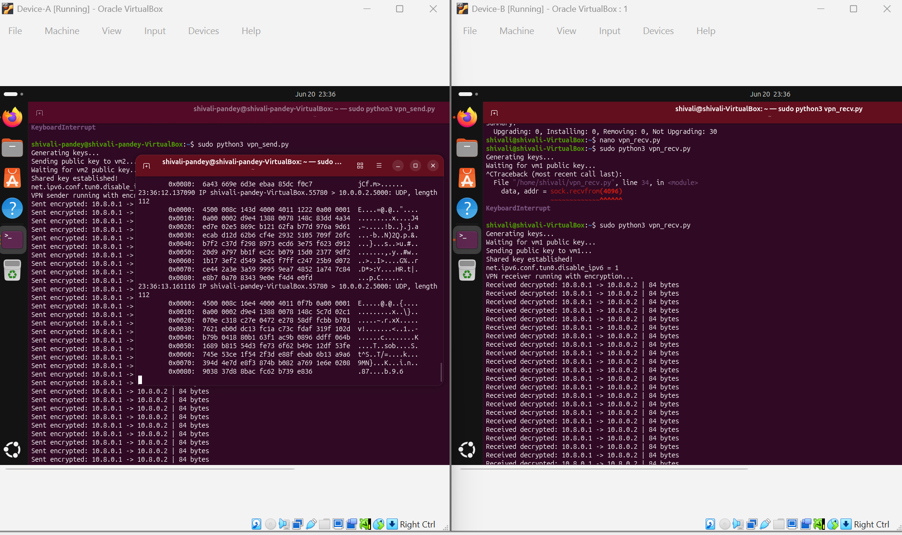
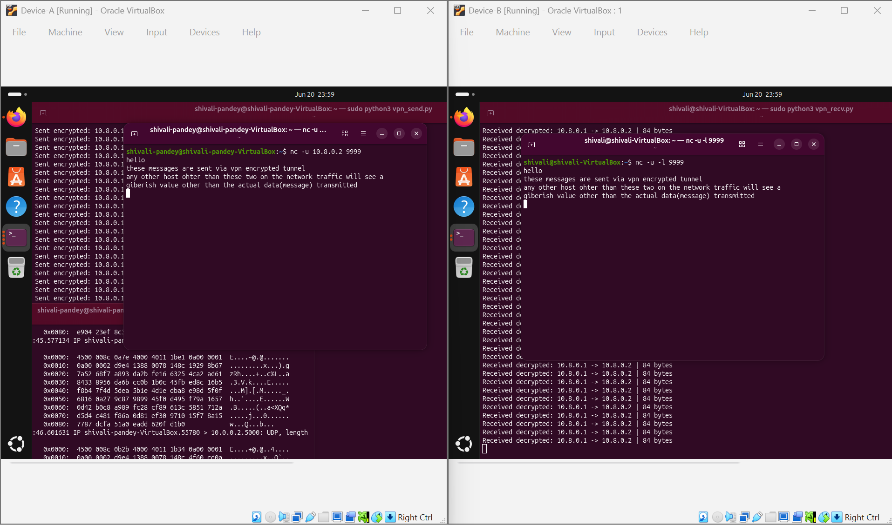

# VPN From Scratch

A fully working VPN tunnel built from scratch in Python. No VPN libraries used. 
Just raw TUN interfaces, a cryptographic X25519 key exchange, and packet level encryption(ChaCha20-Poly1305 encryption)
between two Linux machines.

---

## What it does

This project creates an encrypted tunnel between two Linux machines. Any traffic 
sent through the tunnel is completely unreadable on the wire — anyone intercepting 
it sees pure gibberish. But at the destination, it arrives perfectly decrypted and 
readable, exactly like a real VPN.

To prove it works, a secret message typed on one machine travels across the network 
as encrypted noise and arrives in plain text on the other side.

---

## How it works
[Application on vm1]
↓
[OS generates IPv4 packet]
↓
[Routing table directs it to tun0]
↓
[vpn_send.py intercepts it from tun0]
↓
[ChaCha20-Poly1305 encrypts it]
↓
[nonce + ciphertext sent over UDP]
↓ (travels as gibberish on the real network)
[vpn_recv.py receives the UDP packet]
↓
[ChaCha20-Poly1305 decrypts it]
↓
[Decrypted packet injected into tun0 on vm2]
↓
[Application on vm2 receives it in plain text]

---

## Project structure
vpn-from-scratch/

├── tun_read.py       # learning script — reads and parses raw packets from tun0

├── vpn_send.py       # runs on vm1 — intercepts, encrypts, and sends packets

├── vpn_recv.py       # runs on vm2 — receives, decrypts, and reinjects packets

└── requirements.txt  # Python dependencies

---

## Why these specific choices

**TUN over TAP**
TUN operates at Layer 3 meaning it works with raw IP packets, which is exactly 
the level a VPN needs. TAP operates at Layer 2 with Ethernet frames, which adds 
unnecessary complexity for this use case.

**ChaCha20-Poly1305 over AES-GCM**
Both are secure AEAD ciphers. ChaCha20-Poly1305 is faster in pure software on 
machines without hardware AES acceleration, which VMs typically lack. It is also 
the algorithm WireGuard uses, making it a well validated modern choice.

**X25519 over RSA**
X25519 is an elliptic curve Diffie-Hellman algorithm. It gives strong security 
with much smaller key sizes than RSA, is significantly faster, and is simpler 
to implement correctly without introducing subtle vulnerabilities.

**UDP over TCP for the tunnel**
Wrapping TCP inside TCP causes TCP meltdown — two sets of retransmission and 
congestion control logic fighting each other, causing severe performance collapse. 
UDP gives a clean, lightweight transport layer for the tunnel with no conflict.

**AEAD over plain encryption**
ChaCha20-Poly1305 is an authenticated encryption cipher, meaning it does not just 
encrypt data — it also generates a cryptographic tag proving the data was not 
tampered with in transit. If anyone modifies even a single bit of an encrypted 
packet, decryption fails and the packet is silently dropped. Authentication is 
just as important as encryption.

---

## How the key exchange works

Neither machine ever sends its private key over the network. Here is exactly what 
happens at startup:

1. Both vm1 and vm2 independently generate a random X25519 key pair — a private 
key and a public key
2. They exchange only their public keys over UDP
3. vm1 computes: its own private key combined with vm2's public key → shared secret
4. vm2 computes: its own private key combined with vm1's public key → same shared secret
5. Both machines independently arrive at the identical shared secret

This works because of a mathematical property of elliptic curves:
privateA × publicB == privateB × publicA

Anyone who intercepted the public keys being exchanged cannot derive the shared 
secret without one of the private keys — and those never left their machines.

---

## Environment setup

This project requires two Linux machines or virtual machines on the same network.
It was built and tested on Ubuntu Server running inside VirtualBox on Windows.

**vm1 network configuration:**
- Physical interface (enp0s3): 10.0.0.1/24
- Tunnel interface (tun0): 10.8.0.1/24 (created automatically by the script)

**vm2 network configuration:**
- Physical interface (enp0s3): 10.0.0.2/24
- Tunnel interface (tun0): 10.8.0.2/24 (created automatically by the script)

---

## Requirements
pip install cryptography

Or:
sudo apt install python3-cryptography

---

## How to run

**Step 1 — Start the receiver on vm2 first:**
sudo python3 vpn_recv.py

Wait until it prints:
Waiting for vm1 public key...

**Step 2 — Start the sender on vm1:**
sudo python3 vpn_send.py

Both sides will complete the key exchange and print:
Shared key established! Tunnel is encrypted.

**Step 3 — Send a message through the tunnel:**

On vm2:
nc -u -l 9999

On vm1:
nc -u 10.8.0.2 9999

Type anything on vm1 and press Enter — it arrives in plain text on vm2, 
having travelled through the network fully encrypted.

**Step 4 — See the encryption in action:**

On vm1, open a third terminal and run:
sudo tcpdump -i enp0s3 -X port 5000

This shows the raw UDP traffic on the real network interface — pure encrypted 
gibberish, completely unreadable, even though the message arrived perfectly 
on vm2.

---

## Demo

---

## What I learned

- How TUN/TAP virtual interfaces work at the kernel level and how userspace 
programs attach to them using ioctl system calls
- The exact binary structure of IPv4 packet headers and how to parse them 
byte by byte
- How elliptic curve Diffie-Hellman key exchange works and why the shared 
secret never needs to travel over the network
- Why authenticated encryption matters as much as encryption itself — 
encryption without authentication can be silently tampered with
- Why real VPNs use UDP as the outer transport and what TCP meltdown actually 
means in practice
- How Linux routing tables direct traffic to virtual interfaces automatically 
when you assign an IP to them

---

## Technologies used

- Python 3
- Linux TUN/TAP kernel interface
- `fcntl` and `ioctl` system calls
- `struct` module for binary packet parsing
- `socket` module for UDP communication
- `cryptography` library — X25519 and ChaCha20-Poly1305
- VirtualBox with Ubuntu Server
- Linux networking tools: ip, netplan, tcpdump, netcat

